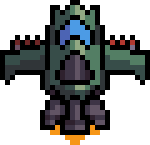
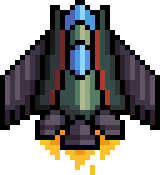
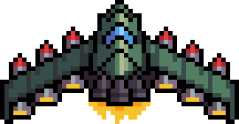
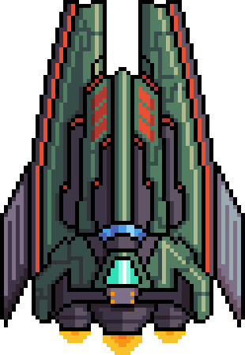

# Сценарий игрового процесса

Игрок при помощи мыши управляет кораблем, который стреляет все время.

На игрока вылетают противники за убийство которых выдаются очки.

В начале уровня есть 3 жизни, при попадании снарядом по герою, а также при столкновении с противником, у игрока отнимается одна жизнь, на уровне можно подбирать дополнительные жизни.

На уровне раскиданы различные бонусы которые можно подбирать:

-   Стрельба в 3х направлениях, прямо и под углом 45 градусов в обе стороны.
-   Стрельба шарами большего размера чем начальные спрайты.
-   Стрельба, в течение 3х секунд, непрерывным лучом который уничтожает всех врагов мгновенно, после окончания эффекта стрельба идет в том режиме в каком была до этого.
-   Щит защищающий от 1 попадания, существует 15 секунд.
-   Бонус x2 к выдаваемым очкам, действует 15 секунд

_Можно добавить:_

-   [ ] Боссы. Большие корабли у которых сначала нужно разбить орудия, а потом "ядро".
-   [ ] Мини боссы. Примерно как обычные противники, но у них есть полоска здоровья.
-   [ ] Бонусные уровни. Игра может включать в себя бонусные уровни или мини-игры, которые предложат игроку различные задания, отличные от основной геймплейной механики.
-   [ ] Cюжет с диалогами, персонажами и какой-то целью.

|              Корабль              | Описание                                                                                                                                            |
| :-------------------------------: | :-------------------------------------------------------------------------------------------------------------------------------------------------- |
|  | Главный корабль                                                                                                                                     |
|  | Базовый враг, нужно одно попадание, не стреляют, летят по траектории и могут врезаться, если их не убить они просто улетят, за него дается 10 очков |
|  | Враг второго уровня, стреляют, летают вверху экрана, требуют 2 попадания, 20 очков                                                                  |
|  | Враг третьего уровня, так же как 2й, но требуют 5 попаданий, 50 очков                                                                               |

В игре ограниченное количество уровней, по окончанию которых будет показан экран с таблицей лидеров.

# Сюжет (сгенерен chatGPT)

Наш герой - космический пилот, который работает на корабле-боевике в захватывающем и безжалостном мире космоса. Во время одного из своих заданий, он получает секретную информацию о зловещем плане захвата галактики темной силой, известной как "Черная Звезда".

С горящим желанием противостоять этой угрозе, пилот собирает команду элитных боевых специалистов, которые готовы жертвовать своей жизнью ради спасения галактики. Вместе они отправляются в грандиозное путешествие через космос, сражаясь с наступающими волнами врагов и обманчивыми ловушками Черной Звезды.

По мере продвижения по галактике, команда открывает страшные тайны и встречает многочисленные препятствия, угрожающие их жизням и успеху миссии. Они сталкиваются с коварными космическими пиратами, дроидами-убийцами и могущественными противниками, чья единственная цель - уничтожение команды и захват галактики.

Однако, с помощью мастерства пилотирования и совместной работы, команда решает все трудности и добирается до Черной Звезды. Там они сражаются с ее одержимым вождем, чья сила и безжалостность оказываются непредсказуемыми.

В эпичной финальной битве команда побеждает злодея, разрушая Черную Звезду и спасая галактику от ее зловещего влияния. Пилот и его команда становятся героями, получая заслуженное признание и благодарность за свой подвиг.

### Архитектура игры

gameEngine/helpers: - вспомогательные методы рассчетов связанные с игрой

trajectoryHelper.ts - вспомогательные методы для рассчета траектории полета

gameEngine/parameters (все параметры которые задаются один раз на всю игру):

gameLevels.ts - вся логика связанная с уровнями игры, сколько уровней, описание логики каждого уровня: время уровня, бонусы на уровне, количество врагов каждого типа и траектория их движения/выстрелы, особые ловушки врагов и т.п.

gameParameters.ts - общие параметры игры: размер игровой области, фоновое изображение и т.п.

gameObjectsParameters.ts - параметры игровых обьектов: размеры и картинки для выстрелов, размеры и картинки для врагов и игрока

gameEngine/store:

mockGameState.ts - моковый прототип стейта игры (впоследствии стейт будет хранится в редакс). Стейт хранит состояние игры: текущий уровень, массив кораблей врагов, корабль игрока, массив выстрелов, бонусов для отрисовки.

gameEngine/types:

commonTypes.ts - общие типы игры: точка координат, тип корабля, тип выстрела, а также общий тип отрисовываемого обьекта (DrawableGameObject) у которого есть общий тип состояния с координатами для отрисовки и общий тип параметров с размерами.

gameTypes.ts - игровые типы: общий тип отрисовываемого обьекта, его наследники корабль и выстрел

trajectory.ts - класс отвечающий за плавную траекторию движения корабля, может вычислять путь корабля по заданному внутри уровня массиву точек. Экземпляр траектории хранится в каждом экземпляре вражеского корабля чтобы он знал как ему лететь на данном уровне (логика инкапсулирована)

gameEngine:

collisionManager.ts - определяет коллизии по текущему стейту

gameEngine.ts - загрузка обложки игры до старта, завершение игры, завершение уровня, конец игры, старт, пауза. Сейчас тут есть логика обработки движений пользователя, также objectAnimator.ts принимает функции отрисовки поля, завершения игры и завершения уровня - возможно стоит пересмотреть эти моменты.

objectAnimator.ts - отвечает за анимацию игры, старт и пауза главного цикла игры, главный цикл умеет отрисовывать корабли и выстрелы из стейта игры, определять состояния конца игры и конца уровня

game.module.scss - стили для компонента игры
game.tsx - компонент игры
